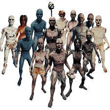

# BESTIAIRE

 *The forest, développé par les studios Nightend Games*

 [accueil](README.md) - bestiaire - [développement](développement.md) -[contact](contact.md)

## Cannibales Basiques

| nom | descriptif | difficulté |
|:----:|:----:|:----:|
|Cannibales Normaux|Leurs apparences est humaine ,et ils sont faciles à distinguer des "Cannibales Normaux" qui sont communément vus dans le jeu. Ils sont trouvés sous formes masculins ou féminins , et peuvent être tués facilement avec des pièges ou du feu. Autre note, ils semblent tous gauchers. De ce fait, aucun cannibale n'a été vu porter une masse avec sa main droite. Couper la tête d'un cadavre va toujours donner une tête de cannibale normale, sans se préoccuper ni du type ni du sexe.|facile|
|Chefs cannibales|Les chefs ont une apparence similaire aux cannibales normaux, mais apparaissent d'avoir des pièces décoratives supplémentaires . Ces détails peuvent être des objets divers comme une lampe, des crânes, ou des membres humains, qui pendent ou sont mis autour de la tête et de leur dos. Ils dirigent certaines parties de recherche et des patrouilles, et les cannibales normaux suivront leur chef. Ils possèdent toujours une source de lumière durant la nuit qui sert de torche improvisée, et ils peuvent l'utiliser quand un joueur est repéré. Si un chef est mis à brûler pour avoir des os, les membres humains attachés à son dos ne donneront aucun os une fois complétement incinérés.|facile|	
|Un Chef Cannibale Incendiaires|Ces cannibales ressemblent aux cannibales normaux, mais ils peuvent utiliser le feu pour tuer le joueur. Ils peuvent venir en groupes importants, mais sont rares. Ils peuvent être vus en train d'utiliser leur propre bâton enflammé comme arme aussi bien bien que les balles de tennis enflammées. Les versions plus rares peuvent utiliser des Dynamites. Ils sont aussi le fléau de ceux qui vivent dans les arbres.|moyen|
|Les grand clair| 	Il ressemble aux autres cannibales mais ils sont plus grand et ont une peau bien plus claire.ils sont plus forts et plus rapide que les autres et il peut aussi posséder les mêmes variantes que les autres types de cannibales.|moyen|
	
## Cannibales Mutants

| nom | descriptif | difficulté |
|:----:|:----:|:----:|
|Octopus (Pieuvre)| 	comme le nom le suggère, ils possèdent de nombreux bras. Ils font quelques têtes de plus que les mutants normaux, et ils sont affreusement bien plus fort qu'eux. Ils envoient leurs bras autours d'eux pour attaquer. Ils sont parfois appelés "Armsy" Ils sont aussi capables de détruire les constructions et les arbres en un ou deux coups, alors vous devrez quitter votre camp au plus vite dès que Armsy sort son gros bengala . Sa présence peut être facilement reconnue par son terrifiant rugissement et grognement, spécialement dans les Grottes.|difficile| 	
|Araignée|Comme le Mutant "pieuvre", elle est plus grande et plus forte que les cannibales normaux, mais à l'instar des bras pour l'Octopus elle a de nombreuses jambes. Le mutant araignée possède une attaque de charge, et est formée en fusionnant deux corps féminins avec l'autre. Elle est capable de détruire les murs et constructions des joueurs. Pour attaquer, Elle lève ses deux jambes avant et charge le joueur. Elle aussi est appelée "Virginia".Elle peut sauter par dessus une certaine distance et est capable de frapper à travers un mur invisible. Contrairement au Armsy, Virginia est plus silencieuse alors difficile de reconnaître sa présence. Ses Bébés peuvent en tout cas révéler leur présence par leur cris et leurs sons un peu Squishy (gélatineux?) quand ils sautent .|difficile| 	
Graisseux| 	Autre forme de mutant avancé,Plus grand et large que le mutant basique. Il a une apparence plus humaine avec deux bras et des jambes, dont le détail le plus à noter est qu'il est extrêmement en surpoids. Il attaque le plus souvent en chargeant le joueur, changeant sa direction pendant sa charge pour tenter de tuer le joueur s'il essaie de se déplacer hors du chemin. Leur Charge est aussi la seule attaque de mutant/cannibale qui peut passer à travers l'armure d'un joueur le blessant aussi bien. Il peut aussi être vu en train de sauter en l'air et essayer une onde de choc avec son corps, même si on ne sait pas ce qui déclenche cette attaque.Les cocktails Molotov et les armes impliquant du feu peuvent marcher sur lui, les explosifs peuvent paralyser les Graisseux (voire les tuer), et les frapper avec une arme de mêlée peut en effet le tuer. Le Graisseux est connu pour faire planter le jeu ou pour provoquer des lags horribles comme pas permis. Si il est rencontré à la surface, des cannibales peuvent aussi être présents.|difficile| 	
Mutant Megan Cross|ce mutant porte ce nom car il s'agit d'un mutant de parties avancés car on ne peut l'observer uniquement après avoir combattu le boss du jeu qui lui ressemble énormément.|difficile|

## Autres

| nom | descriptif | difficulté |
|:----:|:----:|:----:|
Cannibales Affamés |Les cannibales affamés sont une forme séparée du cannibale normal. Ils sont parfois hostiles envers les autres cannibales aussi bien que vous. Ils sont plus faibles, mais sont plus agressifs et rapides. ils sont distingués par leurs corps presque complétement couvert de sang. Les cannibales affamés et les normaux peuvent être vus en train de coopérer, mais les cannibales affamés peuvent facilement trahir et rejoindre leur homologue plus puissant.|moyen| 	
Bébés Mutants| 	Dans les parties les plus profondes des grottes , le joueur peut trouver plusieurs Bébés Mutants gîser sur le sol. Ils sont aussi présent à la surface quand un Mutant Araignée est présent. Ils sautent sur le joueur en utilisant leur seule jambe. A la surface, ils peuvent être vus avec le Mutant Araignée, tentant de sauter pour attaquer, et sont capables de causer d'importants dégâts au joueur. Ils peuvent être identifiés par leurs cris inhumains, mais peuvent être tués en un coup.|facile|

© 2023 - The Forest -[Me contacter](cestbidon@bidon.com)